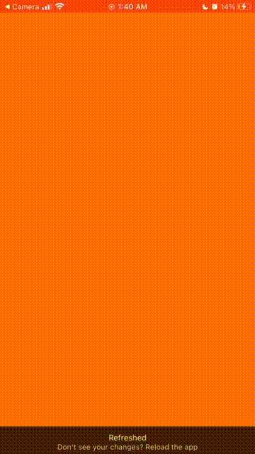
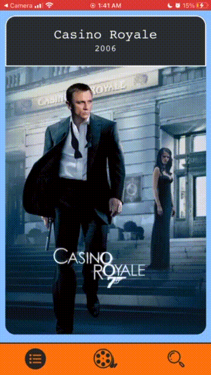
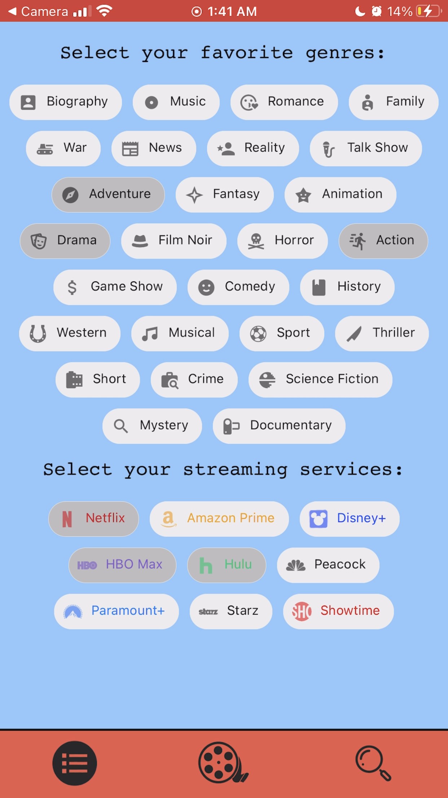

# Cine Swipe

     
    

  <small>Last Updated: March 5th, 2021</small>

# ℹ️ Description

Take on a whole new past time of finding you next movie to watch! Enter in the streaming services you have, and let Cine Swipe reccomend you movies that you can watch immediately! Just swipe right if you like it, and left if you don't, and watch your "to-watch" list grow!

# Original Proposal

  
Click to expand:

    Name of Student:
    Benjamin McFarland

    Name of Project:
    Stream Dating!

    Project's Purpose or Goal: (What will it do for users?)
    A dating-type app, but for movies and TV shows only available on the streaming platforms you currently have.

    List the absolute minimum features the project requires to meet this purpose or goal:
    An app that can compile a list of movies the user has said they are interested in. The app would only recommend/show movies or shows that are on the streaming services the user states. 

    What tools, frameworks, libraries, APIs, modules, and/or other resources (whatever is specific to your track, and your language) will you use to create this MVP? List them all here. Be specific.
    I know I will probably use the IMDb API to get movie and TV shows information with the streaming platforms they are on, however, there are other APIs out there that have this same information I might use instead. 

    The program itself will mostly rely on React native, possibly using Redux or other libraries or frameworks that we will learn coming up to make this a functional program.

    I might have to use C#, .NET, and MySQL as a back-end database, but I am not entirely sure yet how needed that side will be.

    If you finish developing the minimum viable product (MVP) with time to spare, what will you work on next? Describe these features here: Be specific.
    My next goal would be to have "friends" with features to see movies or shows both users are interested in, as well as messaging, or sending movie/show recommendations.

    Another feature could be where the user can change a setting to see all movies and TV shows, not just from their streaming services.

    I would also like to see if I could make use of some type of AI API to help recommend movies better, but that is a very big stretch goal.

    What additional tools, frameworks, libraries, APIs, or other resources will these additional features require?
    Google or Microsoft AI API if I want to try and add any type of extra power for the recommendations. 

    I will almost certainly have to have the C# back end with identity to hold user login if I want the "friends" feature.

    Is there anything else you'd like your instructor to know?
    I really want to get this as a mobile app, however, if I can't figure out React Native enough in time, I might make it as a website. But I have been looking into React Native a lot recently to try and learn before I start working on it.

# 📷 Examples

  
  
  
  

# 🧑‍💻 Contributers

| Name | GitHub Profile |
|------|----------------|
| [Ben McFarland](https://www.linkedin.com/in/benjamin-mcf/) | [Harzulu](https://github.com/harzulu)|

# ⚙️ Technologies Used

* <a href="https://code.visualstudio.com/">Microsoft Visual Studio Code</a>
* <a href="https://rapidapi.com/movie-of-the-night-movie-of-the-night-default/api/streaming-availability/details">Streaming Availability API</a>
* <a href="https://www.npmjs.com/package/react-native-flip-card">React Native Flip Card</a>
* <a href="https://callstack.github.io/react-native-paper/index.html">React Native Paper</a>
* <a href="https://reactnative.dev/">React Native</a>
* <a href="https://webpack.js.org/">Webpack.js</a>
* <a href="https://github.com/">Git/GitHub</a>
* <a href="https://apps.apple.com/us/app/expo-go/id982107779">Expo Go</a>
* <a href="https://reactjs.org/">React.js</a>
* <a href="https://nodejs.org/en/">Node.js</a>
* <a href="https://expo.io/">Expo</a>

# 💾 Installation Requirements

## For Both Mac & Windows systems

#### To Clone:
- Open your preferred command line program.
- Navigate to the location or directory you'd like the project directory to be created in. (e.g., "cd Desktop" if you'd like to clone the project to your desktop)
- Enter the command "$ git clone https://github.com/harzulu/CineSwipe" in your command line.

#### To Download:
- Navigate to the [project repository](https://github.com/harzulu/CineSwipe) in your browser.
- Click the green "Code" button toward the top right of the page.
- Click "Download ZIP" and extract the files.
- Open the newly-downloaded project in your preferred code editor.

## **This project uses Node.js Project Manager**

# To install Node.js

- Visit <a href="https://nodejs.org/en/download/">this link</a> to find the most recent version of Node.js for your machine.
- Follow the given instructions to install Node.js on you machine to run this project.

# 🖥️ Opening the Project on your Local System

Once the project has been cloned and you have all the necessary items on your local computer, open the project in the application of your choice (<a href="https://code.visualstudio.com/">Visual Code Studio</a> was used and is recommended by the application builder)

## Download the Expo Go app

Currently the only way to use this project on mobile is through the Expo Go app with a live instance of the project going on your machine. Download the <a href="https://apps.apple.com/us/app/expo-go/id982107779">Expo Go app here (iOS)</a>

### Run the project:

- In your terminal or command line: navigate to the root directory of the project.
- In the root directory, run the command `npm install`.
- After you have installed all of the dependancies, run the command `npm start` so run the project.
- A browser window should open with the live site. On that page there should be a QR code, scan that code, and it should open the live project on your mobile device!

# Work log when no git commits

Visit <a href="https://docs.google.com/document/d/1_qQ38JIwrzM6LYjI4_TNoufFSQqPGigdfS_MusOaGZ8/edit?usp=sharing">HERE</a> for a full log of my work when I was not making commits directly to this repo.

# ☎️ Support / Contact Details

* [Ben McFarland](mailto:benrmcfarland@gmail.com)

# 🐛 Bugs / Issues

| Date | Error | Handled | Solution |
| :------------- | :------------- | :------------- | :------------- |
| 3/11/21 | Have to swipe cards with two fingers to still have the tap to flip function | no | none yet |

# ©️ License & Copyright

Copyright (c) 2021 *_Ben McFarland_*

